<h1 align="center">Inference Gateway</h1>

<p align="center">
  <!-- CI Status Badge -->
  <a href="https://github.com/inference-gateway/inference-gateway/actions/workflows/ci.yml?query=branch%3Amain">
    
  </a>
  <!-- Version Badge -->
  <a href="https://github.com/inference-gateway/inference-gateway/releases">
    
  </a>
  <!-- License Badge -->
  <a href="https://github.com/inference-gateway/inference-gateway/blob/main/LICENSE">
    
  </a>
</p>

The Inference Gateway is a proxy server designed to facilitate access to various language model APIs. It allows users to interact with different language models through a unified interface, simplifying the configuration and the process of sending requests and receiving responses from multiple LLMs, enabling an easy use of Mixture of Experts.

- [Key Features](#key-features)
- [Overview](#overview)
- [Middleware Control and Bypass Mechanisms](#middleware-control-and-bypass-mechanisms)
  - [Bypass Headers](#bypass-headers)
  - [Client Control Examples](#client-control-examples)
  - [When to Use Bypass Headers](#when-to-use-bypass-headers)
  - [How It Works Internally](#how-it-works-internally)
- [Model Context Protocol (MCP) Integration](#model-context-protocol-mcp-integration)
- [Agent-to-Agent (A2A) Integration](#agent-to-agent-a2a-integration)
- [Supported API's](#supported-apis)
- [Configuration](#configuration)
- [Examples](#examples)
- [SDKs](#sdks)
- [License](#license)
- [Contributing](#contributing)
- [Motivation](#motivation)

## Key Features

- 📜 **Open Source**: Available under the MIT License.
- 🚀 **Unified API Access**: Proxy requests to multiple language model APIs, including OpenAI, Ollama, Groq, Cohere etc.
- ⚙️ **Environment Configuration**: Easily configure API keys and URLs through environment variables.
- 🔧 **Tool-use Support**: Enable function calling capabilities across supported providers with a unified API.
- 🌐 **MCP Support**: Full Model Context Protocol integration - automatically discover and expose tools from MCP servers to LLMs without client-side tool management.
- 🤝 **A2A Support**: Agent-to-Agent protocol integration - connect to external A2A-compliant agents and automatically expose their skills as tools.
- 🌊 **Streaming Responses**: Stream tokens in real-time as they're generated from language models.
- 🖥️ **Web Interface**: Access through a modern web UI for easy interaction and management.
- 🐳 **Docker Support**: Use Docker and Docker Compose for easy setup and deployment.
- ☸️ **Kubernetes Support**: Ready for deployment in Kubernetes environments.
- 📊 **OpenTelemetry**: Monitor and analyze performance.
- 🛡️ **Production Ready**: Built with production in mind, with configurable timeouts and TLS support.
- 🌿 **Lightweight**: Includes only essential libraries and runtime, resulting in smaller size binary of ~10.8MB.
- 📉 **Minimal Resource Consumption**: Designed to consume minimal resources and have a lower footprint.
- 📚 **Documentation**: Well documented with examples and guides.
- 🧪 **Tested**: Extensively tested with unit tests and integration tests.
- 🛠️ **Maintained**: Actively maintained and developed.
- 📈 **Scalable**: Easily scalable and can be used in a distributed environment - with <a href="https://kubernetes.io/docs/tasks/run-application/horizontal-pod-autoscale/" target="_blank">HPA</a> in Kubernetes.
- 🔒 **Compliance** and Data Privacy: This project does not collect data or analytics, ensuring compliance and data privacy.
- 🏠 **Self-Hosted**: Can be self-hosted for complete control over the deployment environment.

## Overview

You can horizontally scale the Inference Gateway to handle multiple requests from clients. The Inference Gateway will forward the requests to the respective provider and return the response to the client. The following diagram illustrates the flow:

```mermaid
%%{init: {'theme': 'base', 'themeVariables': { 'primaryColor': '#326CE5', 'primaryTextColor': '#fff', 'lineColor': '#5D8AA8', 'secondaryColor': '#006100' }, 'fontFamily': 'Arial', 'flowchart': {'nodeSpacing': 50, 'rankSpacing': 70, 'padding': 15}}}%%


graph TD
    %% Client nodes
    A["👥 Clients / 🤖 Agents"] --> |POST /v1/chat/completions| Auth
    UI["💻 Web UI"] --> |API requests| Auth

    %% Auth node
    Auth["🔒 Optional OIDC"] --> |Auth?| IG1
    Auth --> |Auth?| IG2
    Auth --> |Auth?| IG3

    %% Gateway nodes
    IG1["🖥️ Inference Gateway"] --> P
    IG2["🖥️ Inference Gateway"] --> P
    IG3["🖥️ Inference Gateway"] --> P

    %% MCP Layer
    P["🔌 Proxy Gateway"] --> MCP["🌐 MCP"]
    P --> Direct["Direct Providers"]

    %% Providers
    MCP --> C["🦙 Ollama"]
    MCP --> D["🚀 Groq"]
    MCP --> E["☁️ OpenAI"]
    Direct --> G["⚡ Cloudflare"]
    Direct --> H1["💬 Cohere"]
    Direct --> H2["🧠 Anthropic"]
    Direct --> H3["🐋 DeepSeek"]

    %% Define styles
    classDef client fill:#9370DB,stroke:#333,stroke-width:1px,color:white;
    classDef auth fill:#F5A800,stroke:#333,stroke-width:1px,color:black;
    classDef gateway fill:#326CE5,stroke:#fff,stroke-width:1px,color:white;
    classDef provider fill:#32CD32,stroke:#333,stroke-width:1px,color:white;
    classDef ui fill:#FF6B6B,stroke:#333,stroke-width:1px,color:white;

    %% Apply styles
    class A client;
    class UI ui;
    class Auth auth;
    class IG1,IG2,IG3,P gateway;
    class C,D,E,G,H1,H2,H3 provider;
    class MCP mcp;
    class Direct direct;
```



Client is sending:

```bash
curl -X POST http://localhost:8080/v1/chat/completions
  -d '{
    "model": "openai/gpt-3.5-turbo",
    "messages": [
      {
        "role": "system",
        "content": "You are a pirate."
      },
      {
        "role": "user",
        "content": "Hello, world! How are you doing today?"
      }
    ],
  }'
```

\*\* Internally the request is proxied to OpenAI, the Inference Gateway inferring the provider by the model name.

You can also send the request explicitly using `?provider=openai` or any other supported provider in the URL.

Finally client receives:

```json
{
  "choices": [
    {
      "finish_reason": "stop",
      "index": 0,
      "message": {
        "content": "Ahoy, matey! 🏴‍☠️ The seas be wild, the sun be bright, and this here pirate be ready to conquer the day! What be yer business, landlubber? 🦜",
        "role": "assistant"
      }
    }
  ],
  "created": 1741821109,
  "id": "chatcmpl-dc24995a-7a6e-4d95-9ab3-279ed82080bb",
  "model": "N/A",
  "object": "chat.completion",
  "usage": {
    "completion_tokens": 0,
    "prompt_tokens": 0,
    "total_tokens": 0
  }
}
```

For streaming the tokens simply add to the request body `stream: true`.

## Middleware Control and Bypass Mechanisms

The Inference Gateway uses middleware to process requests and add capabilities like MCP (Model Context Protocol) and A2A (Agent-to-Agent) integrations. Clients can control which middlewares are active using bypass headers:

### Bypass Headers

- **`X-MCP-Bypass`**: Skip MCP middleware processing
- **`X-A2A-Bypass`**: Skip A2A middleware processing

### Client Control Examples

```bash
# Use only MCP capabilities (skip A2A)
curl -X POST http://localhost:8080/v1/chat/completions \
  -H "X-A2A-Bypass: true" \
  -d '{
    "model": "openai/gpt-4",
    "messages": [{"role": "user", "content": "Help me with file operations"}]
  }'

# Use only A2A capabilities (skip MCP)
curl -X POST http://localhost:8080/v1/chat/completions \
  -H "X-MCP-Bypass: true" \
  -d '{
    "model": "anthropic/claude-3-haiku",
    "messages": [{"role": "user", "content": "Connect to external agents"}]
  }'

# Skip both middlewares for direct provider access
curl -X POST http://localhost:8080/v1/chat/completions \
  -H "X-MCP-Bypass: true" \
  -H "X-A2A-Bypass: true" \
  -d '{
    "model": "groq/llama-3-8b",
    "messages": [{"role": "user", "content": "Simple chat without tools"}]
  }'
```

### When to Use Bypass Headers

**For Performance:**

- Skip middleware processing when you don't need tool capabilities
- Reduce latency for simple chat interactions

**For Selective Features:**

- Use only MCP tools (skip A2A): Add `X-A2A-Bypass: true`
- Use only A2A agents (skip MCP): Add `X-MCP-Bypass: true`
- Direct provider access (skip both): Add both headers

**For Development:**

- Test middleware behavior in isolation
- Debug tool integration issues
- Ensure backward compatibility with existing applications

**For Agent Communication:**

- Prevent infinite loops when A2A agents make their own chat completion requests
- Use `X-A2A-Bypass: true` to avoid triggering A2A servers recursively

### How It Works Internally

The middlewares use these same headers to prevent infinite loops during their operation:

**MCP Processing:**

- When tools are detected in a response, the MCP agent makes up to 10 follow-up requests
- Each follow-up request includes `X-MCP-Bypass: true` to skip middleware re-processing
- This allows the agent to iterate without creating circular calls

**A2A Processing:**

- When A2A agents execute skills, they may need to make their own chat requests
- The `X-A2A-Bypass: true` header prevents these internal calls from triggering more A2A processing
- This enables clean agent-to-agent communication

> **Note**: These bypass headers only affect middleware processing. The core chat completions functionality remains available regardless of header values.

## Model Context Protocol (MCP) Integration

Enable MCP to automatically provide tools to LLMs without requiring clients to manage them:

```bash
# Enable MCP and connect to tool servers
export MCP_ENABLE=true
export MCP_SERVERS="http://filesystem-server:3001/mcp,http://search-server:3002/mcp"

# LLMs will automatically discover and use available tools
curl -X POST http://localhost:8080/v1/chat/completions \
  -d '{
    "model": "openai/gpt-4",
    "messages": [{"role": "user", "content": "List files in the current directory"}]
  }'
```

The gateway automatically injects available tools into requests and handles tool execution, making external capabilities seamlessly available to any LLM.

> **Learn more**: [Model Context Protocol Documentation](https://modelcontextprotocol.io/) | [MCP Integration Example](examples/docker-compose/mcp/)

## Agent-to-Agent (A2A) Integration

Enable A2A to connect with external agents and expose their skills as tools:

```bash
# Enable A2A and connect to agent endpoints
export A2A_ENABLE=true
export A2A_AGENTS="http://booking-agent:3001,http://calculator-agent:3002"

# LLMs will automatically discover and use agent skills
curl -X POST http://localhost:8080/v1/chat/completions \
  -d '{
    "model": "openai/gpt-4",
    "messages": [{"role": "user", "content": "Book a flight to New York and calculate the cost"}]
  }'
```

The gateway automatically discovers agent skills, converts them to chat completion tools, and handles skill execution, enabling seamless collaboration between LLMs and external agents.

> **Learn more**: [A2A Protocol Documentation](a2a/README.md) | [A2A Integration Example](examples/docker-compose/a2a/) | [Curated A2A Agents](https://github.com/inference-gateway/awesome-a2a)

## Supported API's

- [OpenAI](https://platform.openai.com/)
- [Ollama](https://ollama.com/)
- [Groq](https://console.groq.com/)
- [Cloudflare](https://www.cloudflare.com/)
- [Cohere](https://docs.cohere.com/docs/the-cohere-platform)
- [Anthropic](https://docs.anthropic.com/en/api/getting-started)
- [DeepSeek](https://api-docs.deepseek.com/)

## Adding New Providers

The Inference Gateway uses an automated code generation system to make onboarding new providers simple and consistent. The system generates all necessary provider files automatically from the OpenAPI specification.

### Quick Start

To add a new provider, follow these simple steps:

1. **Add provider configuration** to `openapi.yaml` under the `Provider` schema's `x-provider-configs` section
2. **Run code generation** with `task generate`
3. **Configure environment variables** for the new provider

### Step-by-Step Guide

#### 1. Configure the Provider

Add your new provider to the `openapi.yaml` file under the `Provider` schema. For example, to add a new provider called "newai":

```yaml
Provider:
  type: string
  enum:
    - ollama
    - groq
    - openai
    - cloudflare
    - cohere
    - anthropic
    - deepseek
    - newai  # Add your provider here
  x-provider-configs:
    # ... existing providers ...
    newai:
      id: "newai"
      url: "https://api.newai.com/v1"
      auth_type: "bearer"  # or "xheader", "query", "none"
      endpoints:
        models:
          name: "list_models"
          method: "GET"
          endpoint: "/models"
        chat:
          name: "chat_completions"
          method: "POST"
          endpoint: "/chat/completions"
```

#### 2. Generate Provider Files

Run the code generation command to automatically create all necessary files:

```bash
task generate
```

This command will:
- Generate a new provider file (`providers/newai.go`) with OpenAI-compatible structure
- Update the provider registry (`providers/registry.go`) to include your provider
- Update configuration files to support the new provider
- Generate constants and types for the new provider

#### 3. Set Environment Variables

Configure your new provider by setting the appropriate environment variables:

```bash
export NEWAI_API_KEY="your-api-key-here"
export NEWAI_API_URL="https://api.newai.com/v1"  # Optional: override default URL
```

#### 4. Test Your Provider

Test the new provider by making a request:

```bash
curl -X POST http://localhost:8080/v1/chat/completions \
  -d '{
    "model": "newai/your-model-name",
    "messages": [{"role": "user", "content": "Hello!"}]
  }'
```

### Protected Files

The code generation system respects existing custom implementations through the `.openapi-ignore` file. Files listed there will not be overwritten during generation:

```
# .openapi-ignore
providers/anthropic.go
providers/cohere.go
providers/cloudflare.go
providers/ollama.go
providers/openai.go
providers/deepseek.go
providers/groq.go
```

If you need custom implementation details for your provider, add it to this ignore file after generation.

### Generated Files

The code generation process creates:

- **Provider implementation** (`providers/{provider}.go`): Contains the `ListModelsResponse` struct and `Transform()` method
- **Provider registry updates** (`providers/registry.go`): Adds your provider to the central registry
- **Configuration updates** (`config/config.go`): Includes environment variable support
- **Common types** (`providers/common_types.go`): Provider constants and endpoints

### Authentication Types

The system supports different authentication methods:

- **`bearer`**: Uses `Authorization: Bearer {token}` header
- **`xheader`**: Uses custom header (like Anthropic's `x-api-key`)
- **`query`**: Adds API key as query parameter
- **`none`**: No authentication required (like local Ollama)

### Benefits

- **Consistency**: All providers follow the same structure and patterns
- **Maintainability**: Changes to the OpenAPI spec automatically update all providers
- **Type Safety**: Generated Go types ensure compile-time correctness
- **Documentation**: Provider configurations are self-documenting in the OpenAPI spec
- **Testing**: Generated code follows established testing patterns

## Configuration

The Inference Gateway can be configured using environment variables. The following [environment variables](./Configurations.md) are supported.

## Examples

- Using [Docker Compose](examples/docker-compose/)
  - [Basic setup](examples/docker-compose/basic/) - Simple configuration with a single provider
  - [MCP Integration](examples/docker-compose/mcp/) - Model Context Protocol with multiple tool servers
  - [A2A Integration](examples/docker-compose/a2a/) - Agent-to-Agent protocol integration
  - [Hybrid deployment](examples/docker-compose/hybrid/) - Multiple providers (cloud + local)
  - [Authentication](examples/docker-compose/authentication/) - OIDC authentication setup
  - [Tools](examples/docker-compose/tools/) - Tool integration examples
  - [Web UI](examples/docker-compose/ui/) - Complete setup with web interface
- Using [Kubernetes](examples/kubernetes/)
  - [Basic setup](examples/kubernetes/basic/) - Simple Kubernetes deployment
  - [MCP Integration](examples/kubernetes/mcp/) - Model Context Protocol in Kubernetes
  - [A2A Integration](examples/kubernetes/a2a/) - Agent-to-Agent deployment
  - [Agent deployment](examples/kubernetes/agent/) - Standalone agent deployment
  - [Hybrid deployment](examples/kubernetes/hybrid/) - Multiple providers in Kubernetes
  - [Authentication](examples/kubernetes/authentication/) - OIDC authentication in Kubernetes
  - [Monitoring](examples/kubernetes/monitoring/) - Observability and monitoring setup
  - [TLS setup](examples/kubernetes/tls/) - TLS/SSL configuration
  - [Web UI](examples/kubernetes/ui/) - Complete setup with web interface
- Using standard [REST endpoints](examples/rest-endpoints/)

## SDKs

More SDKs could be generated using the OpenAPI specification. The following SDKs are currently available:

- [Typescript](https://github.com/inference-gateway/typescript-sdk)
- [Rust](https://github.com/inference-gateway/rust-sdk)
- [Go](https://github.com/inference-gateway/go-sdk)
- [Python](https://github.com/inference-gateway/python-sdk)

## License

This project is licensed under the MIT License.

## Contributing

Found a bug, missing provider, or have a feature in mind?  
You're more than welcome to submit pull requests or open issues for any fixes, improvements, or new ideas!

Please read the [CONTRIBUTING.md](./CONTRIBUTING.md) for more details.

## Motivation

My motivation is to build AI Agents without being tied to a single vendor. By avoiding vendor lock-in and supporting self-hosted LLMs from a single interface, organizations gain both portability and data privacy. You can choose to consume LLMs from a cloud provider or run them entirely offline with Ollama.
